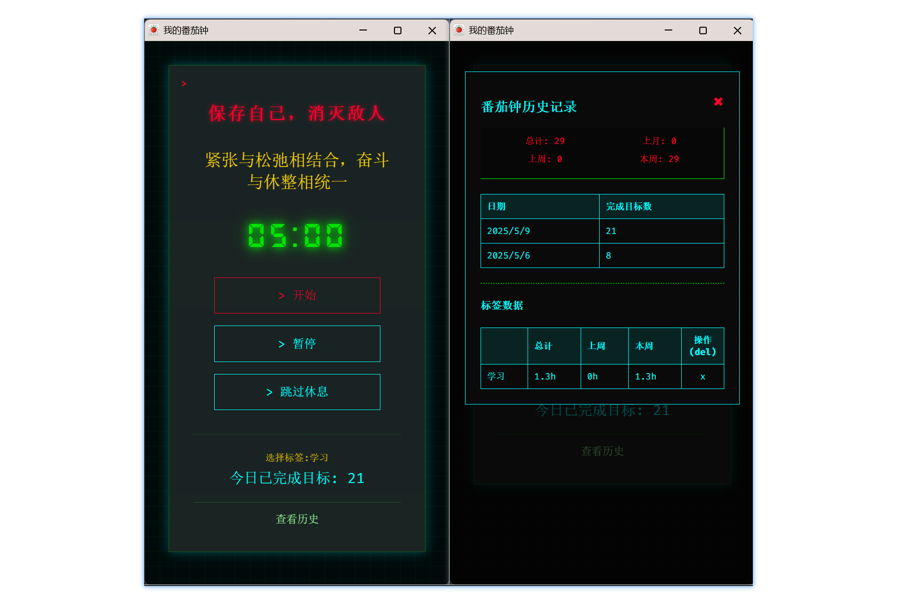

# 🚩Tomato_clock🍅 - 红色赛博番茄钟

**中文 | [English](README_en.md)**

## ✨ 特色功能

### 🛠️ 基础功能

✅ 25 分钟专注倒计时 + 5 分钟休息

✅ Chrome 桌面通知与音乐

✅ 可视化目标完成历史

### 🪄 独特设计

✨ **独立运行窗口**

- 最小化不影响计时与通知 🎵

✨ **智能标签**

- 自由添加/删除工作标签 🏷️
- 标签完成小时数统计报表（总计/上周/本周）📊

## 🚀 安装指南

1. 克隆本仓库 `git clone https://github.com/jcone211/Tomato_clock.git`
2. 访问 Chrome 扩展管理页面 `chrome://extensions/`
3. 启用【开发者模式】
4. 点击【加载已解压的扩展程序】选择项目目录

## ⚠️ 注意事项

1. 首次使用需允许通知权限
2. 窗口最小化时，遵守 chrome 规范，30s 触发一次状态变更，可能导致通知不够精确

## 🦌 待开发新功能

1. 设置页，自定义文本、字体、音乐，更多控制选项 🎚️
2. 导入/导出历史数据 😺

## 🌱 贡献指南

🚀 欢迎提交 Issue 和 PR！
📧 持续更新中 · 最近更新日期：2025.05

[LICENSE](./LICENSE)
