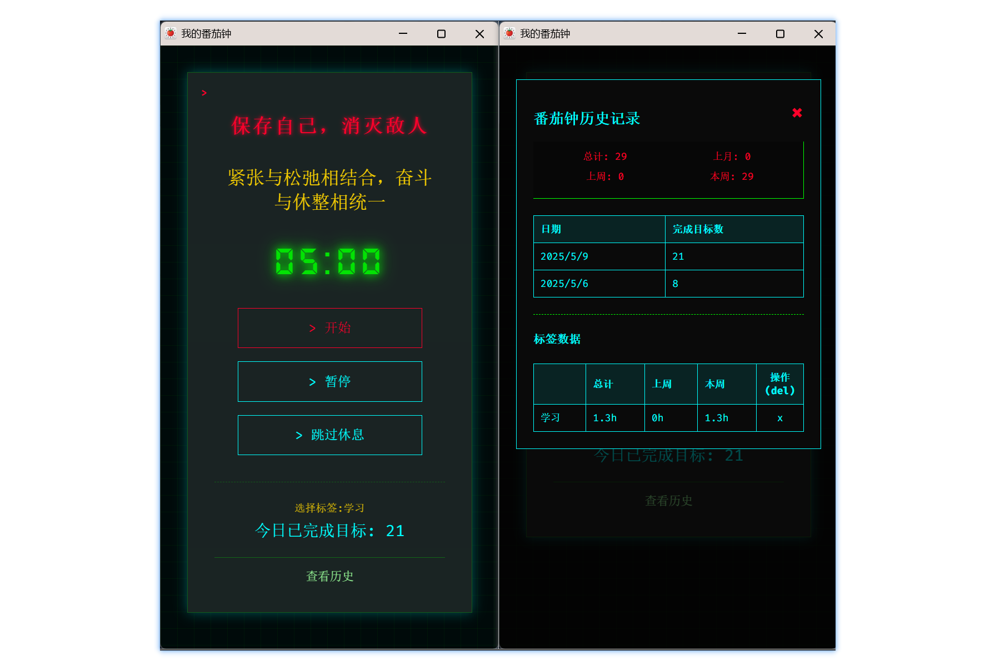

# 🚩Tomato_clock🍅 - Communist Cyborg Pomodoro

**[中文](README.md) | English**

## ✨ Features

### 🛠️ Core

✅ 25min Focus + 5min Break
✅ Chrome Notifications & Inspiring BGM
✅ Visualized Completion History

### 🪄 Unique

✨ **Independent Window**

- Runs in background 🎵

✨ **Smart Tag System**

- Add/Remove custom tags 🏷️
- Auto-generated time analytics (Total/Weekly) 📊

## 🚀 Installation

1. `git clone https://github.com/jcone211/Tomato_clock.git`
2. Go to `chrome://extensions/`
3. Enable Developer Mode
4. Click "Load unpacked" and select folder

## ⚠️ Notes

1. **English version will be supported in the future** ❤
2. Allow notification permissions
3. When the window is minimized, it follows Chrome's specification by triggering a status update every 30 seconds, which may result in less accurate notifications

## 🦌 Feature pending development

1. Settings page: customize text, fonts, music, and more control options 🎚️
2. Import/export historical data 😺

## 🌱 Contribution

🚀 Issues & PRs are welcome!
📧 Ongoing updates · Last update: 2025.05

[LICENSE](./LICENSE)
